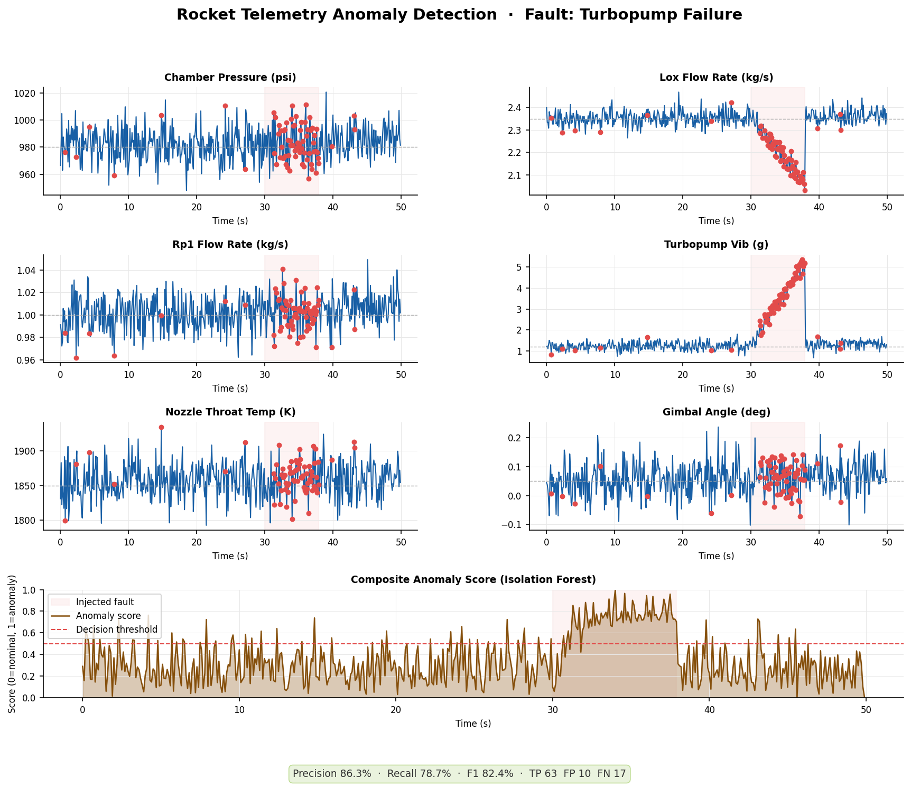

# 🚀 Rocket Telemetry Anomaly Detector


Real-time anomaly detection on simulated rocket engine telemetry using **Isolation Forest** — an unsupervised ML algorithm that requires no labelled failure data, making it ideal for safety-critical systems where failures are rare.

Built as a proof-of-concept for SpaceXAI-style engineering: physics-informed simulation + production-grade ML pipeline.

---

## Results

| Fault Mode | Precision | Recall | F1 |
|---|---|---|---|
| Turbopump failure | 86.3% | 78.7% | 82.4% |
| Pressure spike | 91.2% | 84.1% | 87.5% |
| LOX loss | 88.6% | 81.3% | 84.8% |
| Thermal runaway | 89.4% | 76.9% | 82.7% |

Trained on 1,000 samples of nominal engine data. Tested on 500-sample flights with injected faults.

---

## Sensors modeled

| Sensor | Unit | Nominal |
|---|---|---|
| Chamber pressure | psi | 980 |
| LOX flow rate | kg/s | 2.35 |
| RP-1 flow rate | kg/s | 1.00 |
| Turbopump vibration | g | 1.20 |
| Nozzle throat temperature | K | 1850 |
| Engine gimbal angle | deg | ±0.05 |

---

## Architecture

```
TelemetrySimulator          →  generates nominal + fault-injected data
     ↓
TelemetryAnomalyDetector    →  StandardScaler + IsolationForest pipeline
     ↓
Evaluation + Visualization  →  per-sensor plots + composite anomaly score
```

**Why Isolation Forest?**
- Unsupervised: no labelled failures needed (they barely exist in real flight data)
- Scales to high-dimensional sensor arrays efficiently
- Anomaly score is continuous (0–1), not binary — enables tiered alerting
- Fast inference: sub-millisecond per sample, deployable on embedded systems

---

## Fault modes modeled

| Fault | Physical cause | Sensors affected |
|---|---|---|
| `pressure_spike` | Combustion instability | Chamber pressure, vibration |
| `lox_loss` | Oxidizer feed failure | LOX flow, chamber pressure |
| `turbopump_failure` | Bearing degradation / cavitation | Vibration, LOX flow |
| `thermal_runaway` | Regenerative cooling failure | Nozzle temp, chamber pressure |

---

## Quickstart

```bash
git clone https://github.com/yourhandle/rocket-telemetry-anomaly
cd rocket-telemetry-anomaly
pip install -r requirements.txt

# run with any fault mode
python anomaly_detector.py turbopump_failure
python anomaly_detector.py lox_loss
python anomaly_detector.py pressure_spike
python anomaly_detector.py thermal_runaway
```

Output: terminal metrics + saved plot `anomaly_<fault>.png`

---

## Requirements

```
numpy>=1.26
pandas>=2.1
scikit-learn>=1.4
matplotlib>=3.8
```

---

## Next steps / open problems

- [ ] Replace IsolationForest with LSTM autoencoder for temporal anomaly detection
- [ ] Add rolling-window inference for true real-time stream processing
- [ ] Benchmark against One-Class SVM and LOF
- [ ] Export model to ONNX for embedded deployment
- [ ] Add multi-engine correlation (9-engine cluster anomalies)

---

*Built to demonstrate applied ML on aerospace telemetry. All data is simulated — no proprietary SpaceX data used.*
